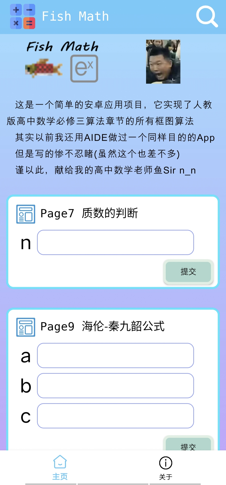

# FishMath

<table rules="none" align="center">
	<tr>
		<td>
			

				
				 
				主页
			

		</td>
		<td>
			

				
				 
				关于
			

		</td>
	</tr>
</table>

这是一个简单的安卓应用项目，它实现了人教版高中数学必修三算法章节的所有框图算法

其实以前我还用AIDE做过一个同样目的的App，但是写的惨不忍睹(虽然这个也差不多)

谨以此，献给我的高中数学老师鱼Sir n_n

# 已知的小问题

Page37的秦九韶算法实现不了

在关于页面按返回键返回主页，下方导航栏显示异常

# 彩蛋

输入作者HowXu和赞助支持LZP的QQ会自动跳转到好友添加页面(我说有点鸡肋这玩意)

输入"晴天"可以听JayChou唱歌
